<div align="center">

# 🛡️ LLMShield

[](https://www.python.org/downloads/)
[](https://www.gnu.org/licenses/agpl-3.0)
[](https://pypi.org/project/llmshield/)
[](https://pypi.org/project/llmshield/)

**Production-ready, zero-dependency Python library for protecting PII in LLM interactions**

_Designed for seamless integration into existing API-dense codebases with minimal configuration overhead_

</div>

## Overview

LLMShield delivers **enterprise-grade protection** for sensitive information in LLM interactions by automatically detecting and replacing PII with secure placeholders before transmission, then restoring original values in responses. The library employs a sophisticated multi-layered detection approach combining advanced pattern recognition, comprehensive dictionary matching, and intelligent contextual analysis.

### Key Features

| Core Capabilities | Advanced Features |
|-------------------|-------------------|
| **Zero Dependencies**<br/>Pure Python implementation with no external requirements | **Conversation Memory**<br/>Multi-turn conversation support with perfect entity consistency |
| **Intelligent Entity Detection**<br/>Automatic PII identification using multi-layered analysis | **Streaming Support**<br/>Real-time processing for streaming LLM responses |
| **Selective Protection**<br/>Granular control over which entity types to protect | **Performance Optimized**<br/>High-performance architecture with intelligent caching |
| **Universal Compatibility**<br/>Works with most LLM providers out of the box | **Production Ready**<br/>Enterprise-grade reliability and security |

## Installation

```bash
pip install llmshield
```

## Quick Start

### Provider Compatibility

LLMShield has been fully tested with these providers:

| Provider | Status | Features |
|----------|--------|----------|
| **OpenAI Chat Completions API** | Full Support | Chat, Structured Output, Streaming, Tools |
| **Anthropic Messages API** | Full Support | Chat, Structured Output, Streaming, Tools |
| **xAI Grok API** | Full Support | Chat, Structured Output, Streaming, Tools |
| **OpenAI Compatibility Standard** | Full Support | Chat, Structured Output, Streaming, Tools |

For providers not directly supported (Google, Cohere), use OpenAI-compatible wrappers.

> **Note:** Due to model behavior differences, slight performance variations may occur. Tune parameters and PII filtration levels based on your requirements.

### Basic Usage

```python
from openai import OpenAI
from llmshield import LLMShield

# Initialize with any LLM provider
client = OpenAI(api_key="your-api-key")
shield = LLMShield(llm_func=client.chat.completions.create)

# Single request with automatic protection
messages = [
    {"role": "user", "content": "Draft an email to Sarah Johnson at sarah.j@techcorp.com"}
]
response = shield.ask(model="gpt-4", messages=messages)

# Multi-turn conversation with entity consistency
messages = [
    {"role": "user", "content": "I'm John Smith from DataCorp"},
    {"role": "assistant", "content": "Hello! How can I help you?"},
    {"role": "user", "content": "Email me at john@datacorp.com"}
]
response = shield.ask(model="gpt-4", messages=messages)
```

### Streaming Support

```python
messages = [
    {"role": "user", "content": "Generate a report about Jane Doe (jane@example.com)"}
]
response_stream = shield.ask(model="gpt-4", messages=messages, stream=True)

for chunk in response_stream:
    print(chunk, end="", flush=True)
```

### Manual Protection (Advanced)

For custom LLM integrations:

```python
shield = LLMShield()

# Protect sensitive information
cloaked_prompt, entity_map = shield.cloak(
    "Contact John Doe at john.doe@company.com or call +1-555-0123"
)
print(cloaked_prompt)
# Output: "Contact <PERSON_0> at <EMAIL_1> or call <PHONE_2>"

# Process with LLM
llm_response = your_llm_function(cloaked_prompt)

# Restore original entities
restored_response = shield.uncloak(llm_response, entity_map)
```

> **Important:** Individual `cloak()` and `uncloak()` methods support single messages only and do not maintain conversation history. For multi-turn conversations with entity consistency across messages, use the `ask()` method.

## High-Level Data Flow

```mermaid
graph LR
    A["Raw Input<br/>'Contact Dr. Smith at smith@hospital.org'"] --> B["Entity Detection<br/>PERSON: Dr. Smith<br/>EMAIL: smith@hospital.org"]

    B --> C["PII Anonymization<br/>'Contact <PERSON_0> at <EMAIL_1>'"]

    C --> D["LLM Processing<br/>Safe text sent to<br/>OpenAI, Claude, etc."]

    D --> E["Response Restoration<br/>Placeholders → Original PII"]

    E --> F["Protected Output<br/>'I'll help you contact Dr. Smith<br/>at smith@hospital.org'"]

    %% Styling
    classDef flowStyle fill:#f8f9fa,stroke:#495057,stroke-width:2px,color:#212529
    classDef detectionStyle fill:#e8f4f8,stroke:#0c63e4,stroke-width:2px,color:#212529
    classDef anonymizationStyle fill:#fff3cd,stroke:#856404,stroke-width:2px,color:#212529
    classDef llmStyle fill:#f0e6ff,stroke:#6f42c1,stroke-width:2px,color:#212529
    classDef restorationStyle fill:#d1ecf1,stroke:#0c5460,stroke-width:2px,color:#212529

    class A flowStyle
    class B detectionStyle
    class C anonymizationStyle
    class D llmStyle
    class E restorationStyle
    class F flowStyle
```

<div align="center">



</div>

## Under the Hood: System Architecture

<div align="center">


</div>

## Entity Detection

The library detects and protects the following entity types:

| Entity Type | Examples | Placeholder Format |
|-------------|----------|--------------------|
| **Person** | John Doe, Dr. Smith | `<PERSON_0>` |
| **Organisation** | Acme Corp, NHS | `<ORGANISATION_0>` |
| **Place** | London, Main Street | `<PLACE_0>` |
| **Email** | user@domain.com | `<EMAIL_0>` |
| **Phone** | +1-555-0123 | `<PHONE_0>` |
| **URL** | https://example.com | `<URL_0>` |
| **Credit Card** | 4111-1111-1111-1111 | `<CREDIT_CARD_0>` |
| **IP Address** | 192.168.1.1 | `<IP_ADDRESS_0>` |

## Built-in Memory for Multi-Turn Conversations

> **Pro Tip:** LLMShield maintains entity consistency across conversation turns, ensuring the same person or organization always gets the same placeholder throughout your entire conversation. Unlike competing solutions that require complex implementation overhead or dependency-heavy architectures, LLMShield provides this sophisticated conversation memory as a core feature with zero external dependencies and superior performance through its optimised pure Python implementation.

<div align="center">


</div>

## Provider Setup Examples

<details>
<summary><strong>OpenAI Configuration</strong> - Standard & Beta APIs with full feature support</summary>

```python
from openai import OpenAI
import llmshield

# Configuration constants
OPENAI_API_KEY = "your-openai-api-key"
AI_MAX_RETRIES = 3
AI_TIMEOUT = 30.0
OPENAI_MODEL = "gpt-4o"

# Initialize OpenAI client
openai_client = OpenAI(
    api_key=OPENAI_API_KEY,
    max_retries=AI_MAX_RETRIES,
    timeout=AI_TIMEOUT,
)

# Standard Chat Completions API
openai_shield = llmshield.LLMShield(
    llm_func=openai_client.chat.completions.create
)

# Beta API with Structured Output
openai_beta_shield = llmshield.LLMShield(
    llm_func=openai_client.beta.chat.completions.parse
)

# Usage examples
messages = [
    {"role": "user", "content": "Draft email to john.doe@company.com about Q4 report"}
]

response = openai_shield.ask(model=OPENAI_MODEL, messages=messages)

# Streaming with protection
messages = [
    {"role": "user", "content": "Generate customer report for Alice Smith"}
]

for chunk in openai_shield.ask(model=OPENAI_MODEL, messages=messages, stream=True):
    print(chunk, end="", flush=True)
```

</details>

<details>
<summary><strong>xAI Grok Configuration</strong> - OpenAI-compatible with zero additional setup</summary>

```python
from openai import OpenAI  # xAI uses OpenAI SDK
import llmshield

# Configuration constants
XAI_BASE_URL = "https://api.x.ai/v1"
XAI_API_KEY = "your-xai-api-key"
AI_MAX_RETRIES = 3
AI_TIMEOUT = 30.0
XAI_MODEL = "grok-beta"

# Initialize xAI client
xai_client = OpenAI(
    base_url=XAI_BASE_URL,
    api_key=XAI_API_KEY,
    max_retries=AI_MAX_RETRIES,
    timeout=AI_TIMEOUT,
)

# Create shield - identical to OpenAI setup
xai_shield = llmshield.LLMShield(
    llm_func=xai_client.chat.completions.create
)

# Usage with Grok models
messages = [
    {"role": "user", "content": "Analyze customer data: John Smith, john@company.com, +1-555-0123"}
]

response = xai_shield.ask(model=XAI_MODEL, messages=messages)

# Multi-turn conversations with entity consistency
messages = [
    {"role": "user", "content": "I'm Sarah Johnson from TechCorp"},
    {"role": "assistant", "content": "Hello! How can I help you?"},
    {"role": "user", "content": "Email me the report at sarah.j@techcorp.com"}
]

response = xai_shield.ask(model=XAI_MODEL, messages=messages)
```

</details>

<details>
<summary><strong>Anthropic Configuration</strong> - Native Messages API with advanced tool support</summary>

```python
from anthropic import Anthropic
import llmshield

# Configuration constants
ANTHROPIC_API_KEY = "your-anthropic-api-key"
AI_MAX_RETRIES = 3
AI_TIMEOUT = 30.0
ANTHROPIC_MODEL = "claude-3-5-sonnet-20241022"

# Initialize Anthropic client
anthropic_client = Anthropic(
    api_key=ANTHROPIC_API_KEY,
    max_retries=AI_MAX_RETRIES,
    timeout=AI_TIMEOUT,
)

# Create shield with Messages API
anthropic_shield = llmshield.LLMShield(
    llm_func=anthropic_client.messages.create
)

# Usage with Claude models
messages = [
    {"role": "user", "content": "Review customer info: Alice Cooper, alice@musiccorp.com"}
]

response = anthropic_shield.ask(model=ANTHROPIC_MODEL, messages=messages)

# Streaming support
messages = [
    {"role": "user", "content": "Generate report for client data"}
]

for chunk in anthropic_shield.ask(model=ANTHROPIC_MODEL, messages=messages, stream=True):
    print(chunk, end="", flush=True)

# Tool usage with PII protection
PHONE_TOOL_SCHEMA = {
    "name": "make_call",
    "description": "Make a phone call",
    "input_schema": {
        "type": "object",
        "properties": {"phone": {"type": "string"}},
        "required": ["phone"]
    }
}

messages = [
    {"role": "user", "content": "Call John Doe at +1-555-0123"}
]

response = anthropic_shield.ask(
    model=ANTHROPIC_MODEL,
    messages=messages,
    tools=[PHONE_TOOL_SCHEMA]
)
```

</details>

<details>
<summary><strong>OpenAI-Compatible Providers</strong> - Universal setup for any OpenAI-compatible API</summary>

```python
from openai import OpenAI
import llmshield

# Configuration constants - customize for your provider
PROVIDER_BASE_URL = "https://api.your-provider.com/v1"
PROVIDER_API_KEY = "your-provider-api-key"
AI_MAX_RETRIES = 3
AI_TIMEOUT = 30.0
PROVIDER_MODEL = "provider-specific-model"

# Generic OpenAI-compatible provider setup
compatible_client = OpenAI(
    base_url=PROVIDER_BASE_URL,
    api_key=PROVIDER_API_KEY,
    max_retries=AI_MAX_RETRIES,
    timeout=AI_TIMEOUT,
)

# Create shield - same interface for all providers
provider_shield = llmshield.LLMShield(
    llm_func=compatible_client.chat.completions.create
)

# Usage with any OpenAI-compatible provider
messages = [
    {"role": "user", "content": "Process data: Emma Wilson, emma@startup.io, 192.168.1.100"}
]

response = provider_shield.ask(model=PROVIDER_MODEL, messages=messages)
```

**Compatible Providers Include:**

- **Together AI** • **Fireworks AI** • **Anyscale** • **Replicate**
- **Groq** • **Perplexity** • **DeepInfra** • **OpenRouter**
- **Local deployments** (Ollama, vLLM, etc.)

</details>

> **Zero Learning Curve:** Same `LLMShield` interface works across all providers. Switch between OpenAI, xAI, Anthropic, and compatible providers without changing your code structure.

## Configuration

### Custom Delimiters

```python
shield = LLMShield(
    start_delimiter='[[',
    end_delimiter=']]'
)
# Entities appear as [[PERSON_0]], [[EMAIL_1]], etc.
```

### Conversation Caching

LLMShield implements an **LRU (Least Recently Used) cache** to maintain entity consistency across multi-turn conversations. The cache stores entity mappings for conversation histories, ensuring that all entities (persons, organizations, emails, phones, etc.) mentioned in different messages receive the same placeholders.

```python
shield = LLMShield(
    llm_func=your_llm_function,
    max_cache_size=1000  # Default: 1000
)
```

#### Cache Sizing Guidelines

<table>
<tr>
<td width="33%">

**Small Applications**

- < 1,000 concurrent conversations
- `max_cache_size=500-1000`
- ~500KB-1MB memory

</td>
<td width="33%">

**Medium Applications**

- 1,000-10,000 concurrent conversations
- `max_cache_size=5000-10000`
- ~5MB-10MB memory

</td>
<td width="33%">

**Large Applications**

- > 100,000 concurrent conversations
- `max_cache_size=50000-100000`
- ~50MB-100MB memory

</td>
</tr>
</table>

**Memory Calculation:** Each conversation stores a dictionary mapping PII entities to their placeholders. With an average of 20 PII entities per conversation, each cache entry uses approximately 1-2KB of memory (entity text + placeholder mappings + metadata).

**Cache Strategy Decision Tree:**

<div align="center">


</div>

**Per-Shield Caching Strategy:**

Each `LLMShield` instance maintains its own independent cache, providing flexibility for:

- **Demographic Partitioning**: Separate caches for different user types (premium vs. free, geographic regions, etc.)
- **Use Case Isolation**: Different cache strategies for customer service vs. internal tools vs. public APIs
- **Memory Allocation**: Distribute memory budgets across multiple shield instances based on priority
- **Custom Strategies**: Implement specialized caching logic for specific workflows or data sensitivity levels

**Cache Effectiveness Factors:**

- **Short-lived workers**: Cache benefits diminish with frequent recycling - prioritize memory efficiency
- **Long-lived workers**: Larger caches significantly reduce "cold start" latency for entity detection
- **Worker density**: Many workers sharing server resources require smaller per-worker caches
- **Traffic variability**: Spiky loads benefit from larger caches to handle burst scenarios

> **Performance Impact:** Cache hit rates above 80% significantly improve performance for multi-turn conversations by avoiding re-detection of previously seen entities. Size your cache based on expected concurrent "fresh" conversations that your server workers are actively serving, not total daily volume.

### Selective PII Detection

> **New in v1.0+:** LLMShield supports selective entity detection, allowing you to disable specific types of PII protection based on your requirements. This is useful when you want to protect some sensitive information while allowing other data types to pass through unchanged.

#### Factory Methods for Common Configurations

```python
from llmshield import LLMShield

# Disable location-based entities (PLACE, IP_ADDRESS, URL)
shield = LLMShield.disable_locations()

# Disable person detection only
shield = LLMShield.disable_persons()

# Disable contact information (EMAIL, PHONE)
shield = LLMShield.disable_contacts()

# Enable only financial entities (CREDIT_CARD)
shield = LLMShield.only_financial()
```

#### Custom Entity Configuration

For fine-grained control, use the `EntityConfig` class:

```python
from llmshield import LLMShield
from llmshield.entity_detector import EntityConfig, EntityType

# Create custom configuration
config = EntityConfig().with_disabled(
    EntityType.EMAIL,      # Disable email detection
    EntityType.PHONE,      # Disable phone detection
    EntityType.URL         # Disable URL detection
)

shield = LLMShield(entity_config=config)

# Or enable only specific types
config = EntityConfig().with_enabled(
    EntityType.PERSON,     # Only detect persons
    EntityType.CREDIT_CARD # Only detect credit cards
)

shield = LLMShield(entity_config=config)
```

#### Available Entity Types

<details>
<summary><strong>All configurable entity types</strong></summary>

```python
EntityType.PERSON          # Names (John Doe, Dr. Smith)
EntityType.ORGANISATION    # Companies (Microsoft Corp)
EntityType.PLACE           # Locations (London, Main Street)
EntityType.EMAIL           # Email addresses
EntityType.PHONE           # Phone numbers
EntityType.URL             # Web addresses
EntityType.CREDIT_CARD     # Credit card numbers
EntityType.IP_ADDRESS      # IP addresses
EntityType.CONCEPT         # Uppercase concepts (API, SQL)
```

</details>

#### Using Selective Detection with ask()

Selective detection works seamlessly with the `ask()` method for end-to-end protection:

```python
from openai import OpenAI
from llmshield import LLMShield

client = OpenAI(api_key="your-api-key")

# Create shield that ignores URLs and IP addresses
shield = LLMShield.disable_locations(llm_func=client.chat.completions.create)

# This will protect names and emails but allow URLs through
messages = [
    {"role": "user", "content": "Contact John Doe at john@company.com or visit https://company.com"}
]
response = shield.ask(model="gpt-4", messages=messages)
# Cloaked: "Contact <PERSON_0> at <EMAIL_1> or visit https://company.com"
```

#### Performance Benefits

Selective detection can improve performance by:

- **Reducing detection overhead** for unused entity types
- **Minimizing placeholder generation** and entity mapping
- **Faster text processing** with fewer regex operations

<table>
<tr>
<td width="50%">

**Recommended Configurations:**

- **Customer service**: Disable `PLACE` and `URL` if not handling location data
- **Financial applications**: Use `only_financial()` for credit card protection only
- **Internal tools**: Disable `PERSON` detection if processing system logs
- **Public APIs**: Enable all types for maximum protection

</td>
<td width="50%">

**Performance Impact:**

- **Memory usage**: 20-40% reduction
- **Processing speed**: 15-30% improvement
- **Cache efficiency**: Higher hit rates
- **Latency**: Lower response times

</td>
</tr>
</table>

## Language Support

| Language | Support Level | Accuracy |
|----------|---------------|----------|
| **English** | Full optimisation | ~90% |
| **Other languages** | Experimental | ??? |

We are actively working on extending support to additional languages and improving entity detection accuracy.

## Development

### Setup

```bash
git clone https://github.com/brainpolo/llmshield.git
cd llmshield
python -m venv venv
source venv/bin/activate  # Windows: venv\Scripts\activate
pip install -e ".[dev]"
```

### Testing

```bash
# Run all tests
make tests

# Generate coverage report
make coverage

# Run linting and formatting
make ruff

# Check documentation coverage
make doc-coverage
```

### Building and Publishing

```bash
# Install build dependencies
make dev-dependencies

# Build the package
make build
```

### Publishing to PyPI (maintainers only)

1. **Update version** in `pyproject.toml`
2. **Run quality checks**:

   ```bash
   make tests
   make coverage
   make ruff
   ```

3. **Build and publish**:

   ```bash
   make build
   twine upload dist/*
   ```

## Security Considerations

| Security Aspect | Recommendation |
|-----------------|----------------|
| **Validation** | Validate cloaked outputs before LLM transmission |
| **Storage** | Securely store entity mappings for persistent sessions |
| **Delimiters** | Choose delimiters that don't conflict with your data format |
| **Input Validation** | Implement comprehensive input validation |
| **Auditing** | Regularly audit entity detection accuracy |

## Contributing

We welcome contributions! Please see [CONTRIBUTING.md](CONTRIBUTING.md) for development guidelines and contribution process.

## License

This project is licensed under the **GNU Affero General Public License v3.0** - see [LICENSE.txt](LICENSE.txt) for details.

## Support

For questions, issues, or feature requests:

- **GitHub Issues**: [Report bugs or request features](https://github.com/brainpolo/llmshield/issues)
- **Documentation**: [Full documentation](https://llmshield.readthedocs.io)
- **Community**: [Discussions and support](https://github.com/brainpolo/llmshield/discussions)

## Maintainers

- **Aditya Dedhia** ([@adityadedhia](https://github.com/adityadedhia))
- **Sebastian Andres** ([@S-andres0694](https://github.com/S-andres0694))

## Production Usage

LLMShield is used in production environments by [brainful.ai](https://brainful.ai) to protect user data confidentiality.